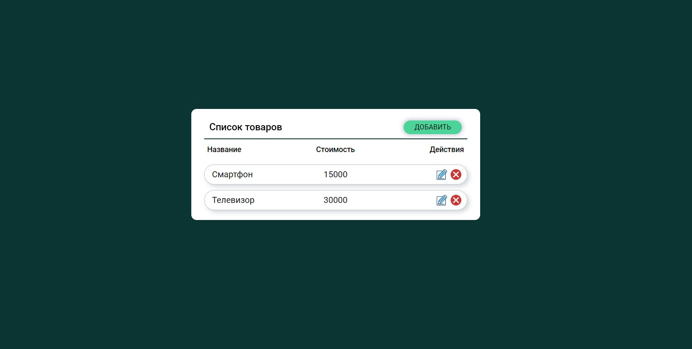
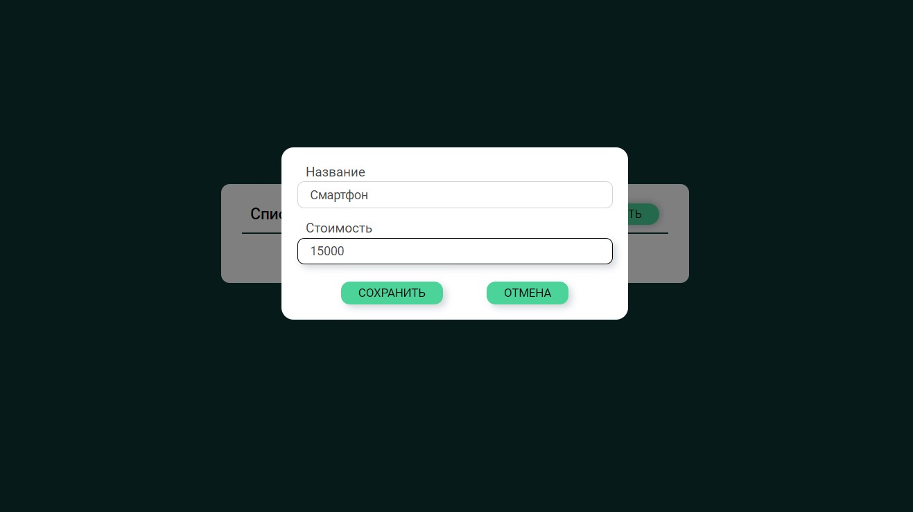

[GitHub Pages](https://lekseff.github.io/AHJ_5-2/)

## Редактор списка

#### Описание

При нажатии на кнопку "Редактировать" или "Добавить" открывается всплывающее окно. Если нажата кнопка "Добавить", то окно пустое, если "✎" (редактировать), то поля заполнены.

Только после нажатия на кнопке "Сохранить", данные в списке обновляются.

При добавлении или редактировании происходит проверка того, что в полях "Название" и "Стоимость" есть текст, причём в поле стоимость допустимы только числа больше 0. Ошибка показывается над соответствующим полем.

При нажатии на кнопку "✕" запись удаляется.